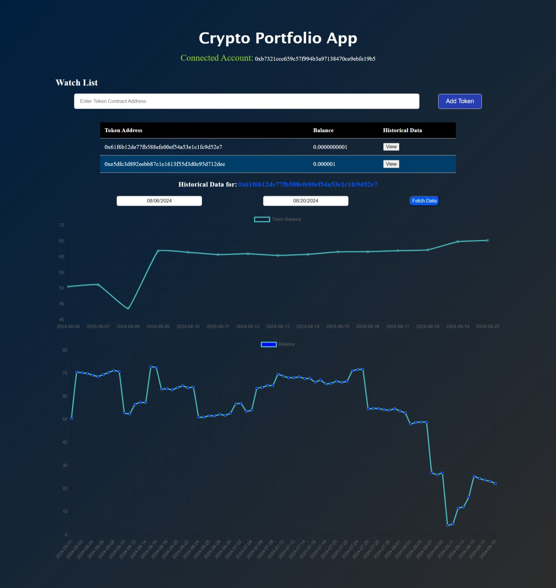

# Crypto Portfolio App

## Description
Crypto Portfolio App is a simple web application that allows users to connect their MetaMask wallet, add tokens to a watchlist using their contract addresses, and view historical balance trends of these tokens over a selected date range. The app is built using React and Ethers.js.



## How to Set Up

### 1. Clone the Repository
Clone this repository to your local machine using the following command:
```bash
git clone https://github.com/gnanashekar2004/cryptoapp.git
```

### 2. Install Node Modules
Navigate to the project directory and install the necessary Node modules:
```bash
cd crypto-portfolio-app
npm install
```
### 3. Start the Development Server
Start the development server using the following command:

```bash
npm start
```
This will start the application on http://localhost:3000.

## Features
### Connect Wallet
- The application automatically connects to your MetaMask wallet (ensure you are logged in through your browser extension).
- Once connected, your wallet address is displayed in the app.
- Add Tokens to Watchlist

## View Historical Balance Trends
- After adding tokens to the watchlist, you can view the historical balance trends of each token.
- Click the "View" button next to a token to select a date range and fetch the historical data.
- The app will display the balance trend as a table and a chart for the selected date range.

## Technologies Used
- React.js: For building the user interface.
- Ethers.js: For interacting with the Ethereum blockchain.
- Chart.js: For displaying historical balance trends in a graphical format.
- MetaMask: For wallet connection and interacting with the Ethereum network.

## Additional Information
- The app is currently set up to work with Ethereum test networks (e.g., Sepolia) and uses mock data for historical balances to demonstrate functionality.
- Ensure that your MetaMask wallet is connected to a test network and that you have test tokens available.